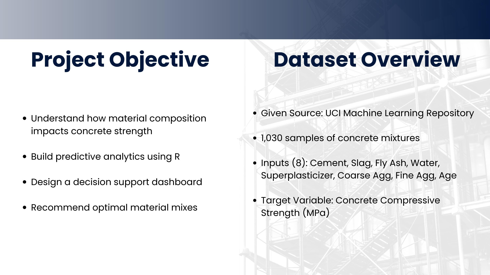

<div align="center">

<h1>Concrete Compressive Strength</h1>

<p>Predicting structural concrete strength from mix composition using regression modelling and an interactive R Shiny decision dashboard.</p>

<br/>


</div>

<br/>

---

Concrete compressive strength determines whether a structure stands or fails. Engineers need to know - before pouring - whether a given mix of cement, water, aggregates, and supplementary binders will meet the required load-bearing threshold. Getting that prediction wrong in either direction has real consequences: too weak and the structure is unsafe, too conservative and material cost climbs unnecessarily.

This project builds an end-to-end predictive analytics solution on 1,030 real laboratory mix experiments. It moves from raw data inspection through feature engineering, exploratory analysis, and regression modelling, and delivers the findings through a fully interactive Shiny dashboard where any engineer can adjust mix parameters in real time and immediately see how strength, sample count, and ingredient relationships respond.

---

## Table of Contents

- [Repository Structure](#repository-structure)
- [Dataset](#dataset)
- [Step 1 — Data Loading and Exploration](#step-1--data-loading-and-exploration)
- [Step 2 — Cleaning and Feature Engineering](#step-2--cleaning-and-feature-engineering)
- [Step 3 — Exploratory Data Analysis](#step-3--exploratory-data-analysis)
- [Step 4 — Regression Modelling](#step-4--regression-modelling)
- [Step 5 — Shiny Dashboard](#step-5--shiny-dashboard)
- [Findings and Recommendations](#findings-and-recommendations)
- [Future Work](#future-work)
- [Getting Started](#getting-started)
- [Technology Stack](#technology-stack)
- [Author](#author)

---

## Repository Structure

```
concrete-strength-dashboard-r-shiny/
│
├── concrete_strength_dashboard.R             # Shiny dashboard — ui and server
├── concrete_analysis_report.Rmd              # Full analysis notebook
├── concrete_data.xls                         # Source dataset — 1,030 experiments
├── Project_Documentation.pdf                 # Project documentation and slides
├── dashboard_walkthrough.mp4                 # Recorded dashboard walkthrough
├── LICENSE
│
└── images/
    ├── slide-objective-dataset.jpg
    ├── slide-load-explore.jpg
    ├── slide-clean-prepare.jpg
    ├── slide-eda.jpg
    ├── slide-kpi-cards.jpg
    ├── slide-viz1.jpg
    ├── slide-viz2.jpg
    └── slide-recommendations.jpg
```

---

## Dataset

<div align="center">

<br/>
<sub>Dataset overview — 1,030 concrete mix experiments, 8 input features, 1 target</sub>
</div>

<br/>

The source is the **UCI Concrete Compressive Strength** dataset compiled by I-Cheng Yeh. Every row is one laboratory experiment — a concrete mix whose ingredients were recorded at the time of batching and whose compressive strength was measured after a specified curing period. No missing values. No synthetic data.

| Feature | Description | Unit |
|:--------|:------------|:----:|
| `Cement` | Portland cement — primary binding agent | kg/m³ |
| `BlastFurnaceSlag` | Industrial by-product — supplementary binder | kg/m³ |
| `FlyAsh` | Coal combustion residue — reduces water demand | kg/m³ |
| `Water` | Water content of the mix | kg/m³ |
| `Superplasticizer` | Chemical additive — improves workability at low W/C | kg/m³ |
| `CoarseAggregate` | Gravel or crushed stone | kg/m³ |
| `FineAggregate` | Sand | kg/m³ |
| `Age` | Curing age at time of strength test | days |
| `CompressiveStrength` | **Target variable** — measured structural strength | MPa |

**Dataset characteristics at a glance:**

| Metric | Value |
|:-------|:------|
| Total observations | 1,030 |
| Missing values | 0 |
| Strength range | 2.33 — 82.6 MPa |
| Age range | 1 — 365 days |
| Engineered feature added | `WC_Ratio` = Water / Cement |

---

## Step 1 — Data Loading and Exploration

<div align="center">

<br/>
<sub>Initial data inspection — structure, types, and summary statistics in RStudio</sub>
</div>

<br/>

The first objective was to understand the dataset as-is, before any transformation. The Excel file was converted to CSV and loaded into R. Three diagnostic functions were run immediately: `str()` to inspect column types and dimensions, `summary()` to check the range and distribution of each variable, and `colSums(is.na())` to confirm completeness.

```r
library(dplyr)

concrete <- read.csv("concrete_data.csv")

str(concrete)
summary(concrete)
head(concrete)
colSums(is.na(concrete))
```

**What the inspection revealed:**

| Check | Finding | Action |
|:------|:--------|:-------|
| Column types | All nine columns numeric | No type conversion needed |
| Missing values | Zero across all columns | No imputation required |
| `FlyAsh` minimum | 0.0 — many mixes used none | Structural zero, not an error |
| `BlastFurnaceSlag` minimum | 0.0 — same pattern | Retained as-is |
| `Age` distribution | Heavy concentration at 28 days | Expected — standard curing benchmark |
| Strength range | 2.33 to 82.6 MPa | Wide variation confirms diverse mix designs |

The zero-minimum values in `FlyAsh` and `BlastFurnaceSlag` are legitimate. In concrete practice, supplementary cementitious materials are optional — many standard mixes use neither. Treating these as anomalies would corrupt the analysis.

---

## Step 2 — Cleaning and Feature Engineering

<div align="center">

<br/>
<sub>Column renaming, zero-value investigation, and Water-Cement Ratio engineering</sub>
</div>

<br/>

Three targeted cleaning operations were performed before analysis began.

**Column renaming.** The original CSV inherited generic header names from the Excel export. All nine columns were renamed in a single assignment to match standard concrete science terminology, ensuring consistency across all downstream code.

```r
colnames(concrete) <- c(
  "Cement", "BlastFurnaceSlag", "FlyAsh", "Water",
  "Superplasticizer", "CoarseAggregate", "FineAggregate",
  "Age", "CompressiveStrength"
)
```

**Zero-value audit on Superplasticizer.** A targeted check confirmed that 379 of the 1,030 mixes contained no superplasticizer. This is not a recording error — superplasticizer is an optional admixture used specifically when a low water-cement ratio is required without losing workability. All 379 rows were retained.

```r
sum(concrete$Superplasticizer == 0)
# 379 — structurally valid zeros, not missing data
```

**Feature engineering — Water-Cement Ratio.** The W/C ratio is the single most discussed predictor in concrete mix design literature. A lower ratio means less excess water relative to cement, which produces denser hydration products and higher strength. This was added as a derived column using `mutate()`.

```r
concrete <- concrete %>%
  mutate(WC_Ratio = Water / Cement)
```

The dataset was now clean, consistently labelled, and augmented with a domain-informed feature — no rows removed, no values imputed.

---

## Step 3 — Exploratory Data Analysis

<div align="center">

<br/>
<sub>Distribution histograms, correlation heatmap, and Cement vs. Strength scatter plot</sub>
</div>

<br/>

EDA was conducted across three layers — distributions, correlations, and pairwise relationships — to build an evidence-based understanding of which variables drive strength and how they relate to each other.

**Distribution histograms** across all nine variables were plotted in a 3x3 grid. Three structural patterns emerged: `CompressiveStrength` showed a right skew concentrated between 20 and 50 MPa; `Age` was heavily peaked at 28 days with sparse observations at higher values; and `FlyAsh` and `BlastFurnaceSlag` were both zero-inflated, consistent with the earlier inspection.

```r
par(mfrow = c(3, 3))
for (col in names(concrete)) {
  hist(concrete[[col]],
       main = paste("Distribution of", col),
       col = "skyblue", xlab = col, border = "white")
}
par(mfrow = c(1, 1))
```

**Correlation matrix** was computed and visualised using `corrplot`. The heatmap confirmed the following relationships:

| Variable | Correlation with Strength | Direction |
|:---------|:--------------------------|:----------|
| `Cement` | Strongest | Positive |
| `Age` | Second strongest | Positive |
| `Water` | Moderate | Negative |
| `WC_Ratio` | Moderate | Negative |
| `Superplasticizer` | Weak-moderate | Positive |
| `CoarseAggregate`, `FineAggregate` | Weak | Mixed |

```r
library(corrplot)
cor_matrix <- cor(concrete)
corrplot(cor_matrix, method = "color", type = "upper",
         tl.col = "black", tl.srt = 45)
```

Potential multicollinearity was noted between the aggregate variables, flagged as a consideration for the regression step.

**Faceted scatter plots** confirmed the directionality of each relationship across all predictors simultaneously:

```r
library(ggplot2)
library(reshape2)

ggplot(melt(concrete, id.vars = "CompressiveStrength"),
       aes(value, CompressiveStrength)) +
  geom_point(alpha = 0.4, color = "steelblue", size = 0.8) +
  facet_wrap(~ variable, scales = "free_x") +
  theme_minimal() +
  labs(title = "Compressive Strength vs. All Predictors",
       x = "Feature Value", y = "Strength (MPa)")
```

The cement and age scatter plots showed clear upward trends. The water and WC_Ratio plots confirmed the inverse relationship. Fly ash showed a positive but dispersed pattern, consistent with its role as a long-term strength contributor.

---

## Step 4 — Regression Modelling

A multiple linear regression model was fitted using all predictor variables, including the engineered `WC_Ratio`. The goal was to quantify the marginal contribution of each ingredient to compressive strength under ceteris paribus conditions, and to establish a predictive baseline for evaluation.

```r
model <- lm(CompressiveStrength ~ ., data = concrete)
summary(model)
```

**Model output:**

| Metric | Value | Interpretation |
|:-------|:------|:---------------|
| Adjusted R² | 0.6125 | The model explains 61.25% of variance in strength |
| Residual Std. Error | 10.4 MPa | Average deviation between actual and predicted values |
| F-statistic | 204.3 on 8 df | Overall model is highly statistically significant |
| p-value | < 2.2e-16 | Extremely strong evidence the model has predictive power |

**Variable significance summary:**

| Variable | Significant (p < 0.05) | Direction |
|:---------|:-----------------------|:----------|
| `Cement` | Yes | Positive |
| `BlastFurnaceSlag` | Yes | Positive |
| `FlyAsh` | Yes | Positive |
| `Water` | Yes | Negative |
| `Superplasticizer` | Yes | Positive |
| `Age` | Yes | Positive |
| `CoarseAggregate` | No | — |
| `FineAggregate` | No | — |

The non-significance of the two aggregate variables is consistent with EDA findings. Their relationship with strength is likely non-linear — a limitation of the linear model that motivates the future work section below.

**Actual vs. Predicted diagnostic plot:**

```r
concrete$predicted <- predict(model)

plot(concrete$CompressiveStrength, concrete$predicted,
     main = "Actual vs. Predicted Compressive Strength",
     xlab = "Actual (MPa)", ylab = "Predicted (MPa)",
     col = "blue", pch = 16, cex = 0.7)
abline(0, 1, col = "red", lwd = 2)
```

Points concentrate near the red reference diagonal in the 20–60 MPa range. Scatter widens above 60 MPa, indicating the linear model underestimates strength at the high end — a pattern that is characteristic of non-linear interactions between cement, age, and the supplementary binders that a linear model cannot fully capture.

---

## Step 5 — Shiny Dashboard

The Shiny dashboard converts the analysis into an operational decision support tool. Rather than presenting static charts, it allows any user to define a mix configuration through sidebar sliders and immediately see how strength metrics, sample distributions, and ingredient relationships shift across that selection.

The entire reactive layer is driven by a single filtered data object:

```r
filtered <- reactive({
  concrete %>%
    filter(
      Age     >= input$ageFilter[1],   Age     <= input$ageFilter[2],
      Cement  >= input$cementRange[1], Cement  <= input$cementRange[2]
    )
})
```

Every output — all three KPI cards and all five charts — is a consumer of `filtered()`. When a slider moves, the reactive graph re-executes only what needs to change.

### Sidebar Inputs

Two range sliders define the active data window:

```r
sliderInput("ageFilter", "Select Age (days):",
            min = min(concrete$Age), max = max(concrete$Age),
            value = c(min(concrete$Age), max(concrete$Age)))

sliderInput("cementRange", "Select Cement Range (kg/m³):",
            min = floor(min(concrete$Cement)),
            max = ceiling(max(concrete$Cement)),
            value = c(min(concrete$Cement), max(concrete$Cement)))
```

A user asking "what does strength look like for 28-day mixes with cement between 250 and 400 kg/m³?" can answer that question in seconds without writing a single line of code.

### KPI Cards

<div align="center">

<br/>
<sub>Live KPI cards — average strength, max strength, and filtered sample count</sub>
</div>

<br/>

Three value boxes at the top of the dashboard give instant summary context for the current filter selection:

```r
output$avg_strength <- renderValueBox({
  valueBox(round(mean(filtered()$CompressiveStrength), 2),
           "Avg Strength (MPa)", icon = icon("chart-line"), color = "light-blue")
})

output$max_strength <- renderValueBox({
  valueBox(round(max(filtered()$CompressiveStrength), 2),
           "Max Strength (MPa)", icon = icon("trophy"), color = "green")
})

output$num_samples <- renderValueBox({
  valueBox(nrow(filtered()),
           "Filtered Mixes", icon = icon("flask"), color = "orange")
})
```

| Card | What It Communicates |
|:-----|:--------------------|
| Average Strength | The expected performance of mixes in the selected range |
| Max Strength | The upper bound — best-case outcome for that configuration |
| Filtered Mixes | How many data points back the current statistics — critical for reliability |

### Charts

<div align="center">

<br/>
<sub>Strength vs. Age with linear trend — Strength vs. WC Ratio with LOESS curve</sub>
</div>

<br/>

<div align="center">

<br/>
<sub>Strength vs. Cement content — Strength vs. Fly Ash contribution</sub>
</div>

<br/>

Four scatter plots update in real time as the sliders change. Each uses a different trend overlay suited to the nature of the relationship:

| Chart | Trend Method | What It Reveals |
|:------|:------------|:----------------|
| Strength vs. Age | Linear (`lm`) | Steady strength gain over curing time — most pronounced in early weeks |
| Strength vs. WC Ratio | LOESS | Clear inverse curve — lower water-cement ratio produces reliably stronger concrete |
| Strength vs. Cement | Linear (`lm`) | Positive relationship with diminishing returns above approximately 400 kg/m³ |
| Strength vs. Fly Ash | Linear (`lm`) | Modest positive trend — fly ash contributes to long-term strength at lower cost |

A full-width **Age x Cement Heatmap** sits below the scatter plots, showing how strength varies across the two-dimensional space of curing time and cement dosage:

```r
output$heatmap <- renderPlot({
  ggplot(filtered(), aes(x = Cement, y = Age, fill = CompressiveStrength)) +
    geom_tile() +
    scale_fill_viridis_c() +
    labs(x = "Cement (kg/m³)", y = "Age (days)", fill = "Strength (MPa)") +
    theme_minimal()
})
```

The viridis colour scale makes the pattern legible at a glance: high-age, high-cement mixes cluster in the upper-right with the deepest colours, confirming that the two strongest drivers of strength act additively.

---

## Findings and Recommendations

<div align="center">

<br/>
<sub>Final findings and mix design recommendations</sub>
</div>

<br/>

The combined evidence from EDA, regression coefficients, and dashboard exploration produces a consistent set of conclusions:

| Finding | Evidence Source | Practical Recommendation |
|:--------|:---------------|:------------------------|
| Cement is the primary strength driver | Highest positive coefficient; clearest scatter trend | Increase cement content for stronger mixes — monitor diminishing returns above ~400 kg/m³ |
| Curing age is equally critical | Second strongest coefficient; steep early-age trend in dashboard | Do not assess strength before 28 days — early measurements systematically underestimate final performance |
| High water content weakens concrete | Negative WC_Ratio coefficient; confirmed by LOESS curve | Minimise water in the mix and use superplasticizer to preserve workability at lower W/C ratios |
| Fly ash and slag both contribute positively | Significant positive coefficients for both | These industrial by-products are effective partial cement replacements — they reduce cost, carbon footprint, and water demand without sacrificing long-term strength |
| Superplasticizer enables strength gains indirectly | Positive significant coefficient | Use superplasticizer to achieve a low W/C ratio in mixes where workability would otherwise require more water |
| Linear model captures 61% of variance | Adjusted R² = 0.6125 | The model is a reliable baseline but leaves 39% unexplained — likely due to non-linear interactions at high cement and high age combinations |

---

## Future Work

The linear regression model is a strong starting point but has identifiable limitations. Three improvements are prioritised:

**Non-linear modelling.** A Random Forest or XGBoost model would capture the interaction effects between age, cement, and the supplementary binders that the linear model cannot represent. The wider prediction scatter above 60 MPa strongly suggests non-linear dynamics in high-strength mixes.

**Extended dashboard controls.** The current filters cover age and cement range. Adding sliders for water content and fly ash dosage would allow users to explore W/C ratio effects directly in the dashboard — closing the gap between the analytical findings and the interactive interface.

**Cost optimisation layer.** Integrating material unit costs per kg/m³ would allow the dashboard to surface not just the strongest mix configuration in a selection, but the most cost-efficient one that still meets a user-defined strength threshold.

---

## Getting Started

**Requirements:** R 4.0 or higher, RStudio recommended.

**Install all dependencies in one command:**

```r
install.packages(c(
  "shiny", "shinydashboard", "tidyverse",
  "ggplot2", "corrplot", "reshape2"
))
```

**To run the Shiny dashboard:**

```r
# Place concrete_strength_dashboard.R and concrete_data.csv in the same directory, then:
shiny::runApp("concrete_strength_dashboard.R")
```

**To run the full analysis notebook:**

Open `concrete_analysis_report.Rmd` in RStudio, update the `read.csv()` path to point to your local copy of the dataset, then click **Knit** to generate a self-contained HTML report.

---

## Technology Stack

| Layer | Tool | Purpose |
|:------|:-----|:--------|
| Language | R | Core analysis and modelling |
| Data wrangling | dplyr, tidyverse | Filtering, mutation, pipes |
| Visualisation | ggplot2, corrplot | EDA charts, heatmaps, scatter plots |
| Data reshaping | reshape2 | Long-format conversion for faceted plots |
| Modelling | base R `lm()` | Multiple linear regression |
| Dashboard UI | shinydashboard | Layout, sidebar, value boxes |
| Dashboard server | shiny | Reactive filtering and chart rendering |
| Reporting | R Markdown | Self-contained analysis notebook |

---

## Documentation and Video

Full methodology notes, model output tables, and the complete project slide deck are in [`Project_Documentation.pdf`](./Project_Documentation.pdf).

A recorded walkthrough of the live dashboard — demonstrating the sidebar filters, KPI cards, and all charts in action — is in [`dashboard_walkthrough.mp4`](./dashboard_walkthrough.mp4).

---

## Author

<div align="center">

**Tejashwini Saravanan**

post2tejashwini@gmail.com

[](https://github.com/TejashwiniSaravanan)

 [LinkedIn](https://www.linkedin.com/in/tejashwinisaravanan/)

</div>

---

## License

Released under the MIT License. Dataset sourced from the [UCI Machine Learning Repository](https://archive.ics.uci.edu/dataset/165/concrete+compressive+strength). See [LICENSE](./LICENSE) for full terms.
