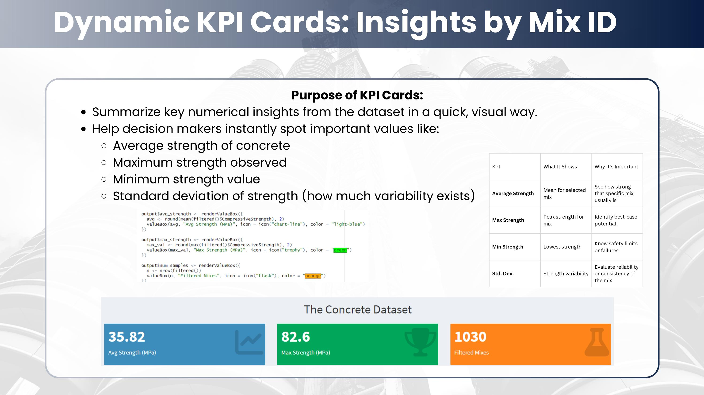
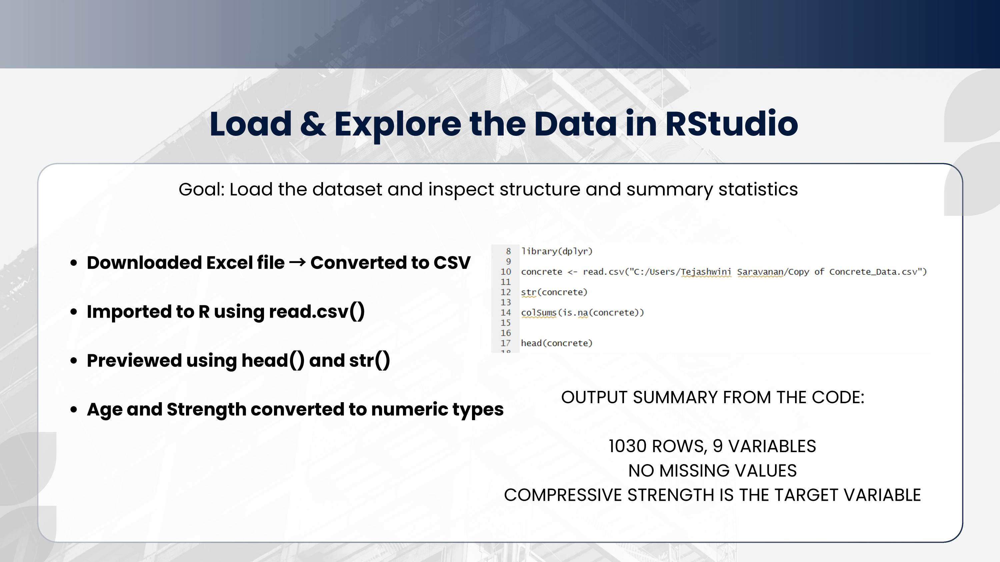
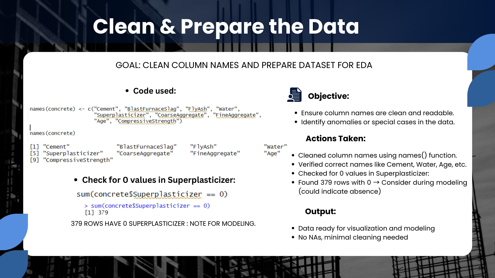
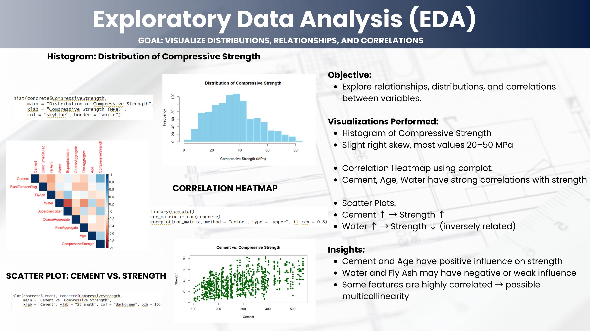
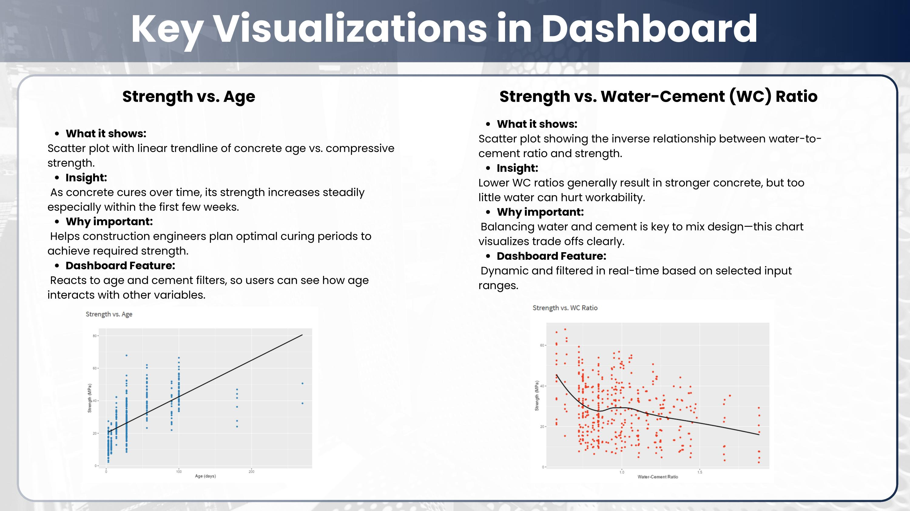
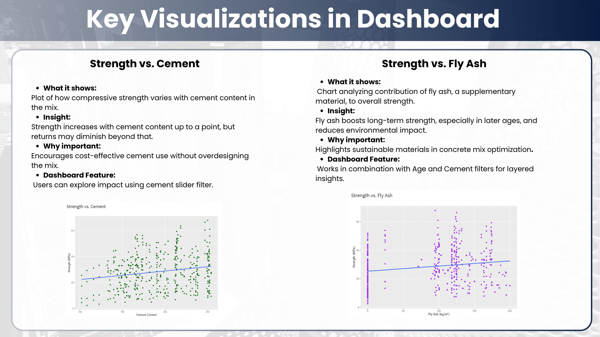
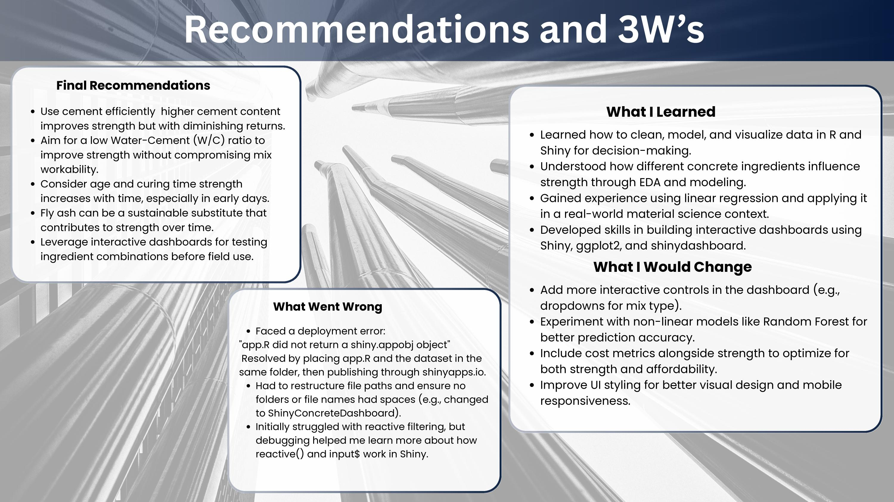

# Concrete Compressive Strength: Predictive Analytics & Interactive R Shiny Dashboard

An end-to-end data analytics project in R that cleans and explores material science data, builds predictive linear regression models, and delivers real-time decision support through an interactive Shiny dashboard. Built for civil engineers and construction managers who need to understand which mix design variables drive concrete strength - without running a statistical model themselves.

<p align="center">
  <a href="Project_Documentation.pdf">View Project Documentation</a> · <a href="dashboard_walkthrough.mp4">Watch Dashboard Walkthrough</a> · <a href="https://tejashwinisaravanan.github.io/concrete-strength-dashboard-r-shiny/">View GitHub Pages</a>
</p>

<p align="center">
  
</p>

<p align="center"><em>The live Shiny dashboard - KPI cards update in real time as users adjust the Age and Cement Content sliders.</em></p>

---

## Overview

Concrete compressive strength is determined by a complex interaction of mix design variables - cement content, water-cement ratio, curing age, supplementary materials like fly ash and blast furnace slag, and aggregate composition. Understanding which variables matter most, and by how much, is critical for structural engineers making mix design decisions under cost and safety constraints.

The challenge is that this knowledge is buried in raw data. A dataset of 1,030 concrete mix experiments with nine variables tells you nothing useful until it is cleaned, explored, modeled, and made interactive. This project does all four steps in R, culminating in a Shiny dashboard that lets any user adjust mix parameters and see filtered results update in real time - no statistical knowledge required.

The same analytical pattern - cleaning messy experimental data, building regression models to identify key drivers, and delivering findings through an interactive interface - applies directly to clinical data in healthcare. Drug dosage optimization, patient outcome prediction, and treatment efficacy analysis all follow the same workflow, just with medical variables instead of construction materials.

---

## The Data

| | |
|---|---|
| Dataset | UCI Concrete Compressive Strength Dataset |
| Records | 1,030 concrete mix experiments |
| Target Variable | Compressive Strength (MPa) |
| Predictor Variables | Cement, Blast Furnace Slag, Fly Ash, Water, Superplasticizer, Coarse Aggregate, Fine Aggregate, Age |
| Engineered Feature | Water-Cement Ratio (Water / Cement) |
| Tool | R, Shiny, ggplot2, tidyverse, shinydashboard |

---

## Project Walkthrough

### Stage 1 - Data Loading and Exploration

<p align="center">
  
</p>

<p align="center"><em>Initial data load - column renaming, structure inspection, and summary statistics to understand the range and distribution of each mix variable before any analysis.</em></p>

The raw dataset uses generic column headers. The first step was renaming all nine columns to meaningful engineering terms - Cement, BlastFurnaceSlag, FlyAsh, Water, Superplasticizer, CoarseAggregate, FineAggregate, Age, and CompressiveStrength. Clear naming matters in any analytical project: it prevents misinterpretation downstream and makes the code readable by domain experts who are not statisticians.

---

### Stage 2 - Data Cleaning and Preparation

<p align="center">
  
</p>

<p align="center"><em>Cleaning pipeline - missing value assessment, outlier inspection, and feature engineering of the Water-Cement Ratio variable.</em></p>

The Water-Cement Ratio (WC Ratio) was engineered as a derived feature by dividing Water by Cement content. This is standard practice in civil engineering - the WC Ratio is one of the most established predictors of concrete strength in the construction industry, and encoding it explicitly allows the model to capture this domain relationship directly rather than leaving it implicit in the raw variables.

The dataset required checking for structural anomalies - records where supplementary materials like Fly Ash or Blast Furnace Slag are zero are valid observations representing plain cement mixes, not missing data. Distinguishing between genuine zeros and missing values is a domain knowledge decision that affects model quality.

---

### Stage 3 - Exploratory Data Analysis

<p align="center">
  
</p>

<p align="center"><em>EDA plots - strength vs Age, strength vs WC Ratio, strength vs Cement content, and strength vs Fly Ash. Each relationship is visualized with a regression trend line to surface directionality before formal modeling.</em></p>

Four key relationships emerged from EDA:

**Age and strength** show a clear positive relationship - concrete continues gaining strength over time as cement hydration progresses. This is a well-known material science phenomenon, but quantifying the rate of gain across the full 1-365 day range in this dataset allows the model to capture non-linearity in early vs. late curing.

**Water-Cement Ratio and strength** show a negative relationship - higher WC ratios produce weaker concrete by increasing porosity. This is the most important mix design trade-off in structural concrete: water is needed for workability but excess water reduces final strength.

**Cement content and strength** show a positive relationship - higher cement concentrations generally produce stronger mixes, though diminishing returns appear at very high cement contents.

**Fly Ash** shows a more complex pattern - it acts as a partial cement replacement that can improve long-term strength while reducing cost, but its effect is highly dependent on curing age.

---

### Stage 4 - Predictive Modeling

A linear regression model was built using all eight mix variables plus the engineered WC Ratio to predict compressive strength. Linear regression was chosen as the primary model for interpretability - the standardized coefficients directly quantify each variable's contribution to strength, which is actionable for mix design decisions in a way that black-box models are not.

Key predictors in order of significance:

- **Age** - strongest positive predictor, confirming that curing time is the single most influential variable on final strength
- **Cement** - positive effect, consistent with EDA findings
- **Superplasticizer** - positive effect, as it allows lower water content while maintaining workability
- **Water-Cement Ratio** - negative effect, the most important mix design constraint
- **Blast Furnace Slag** - positive effect at longer curing ages

The model results are documented in full in the R Markdown report (`concrete_analysis_report.Rmd`) which knits to a reproducible HTML output covering all cleaning steps, model summary, diagnostic plots, and interpretation.

---

### Stage 5 - Interactive Shiny Dashboard

<p align="center">
  
</p>

<p align="center"><em>Dashboard visualization panels - Strength vs Age (top left), Strength vs WC Ratio (top right), Strength vs Cement (bottom left), Strength vs Fly Ash (bottom right). All plots update reactively when sliders are adjusted.</em></p>

<p align="center">
  
</p>

<p align="center"><em>The Age vs Cement heatmap - the viridis color scale maps compressive strength across the two most influential continuous variables simultaneously, revealing the interaction effect that individual scatter plots cannot show.</em></p>

The dashboard is built in R Shiny with `shinydashboard` and `ggplot2`. The architecture separates UI and server logic cleanly - the UI defines two sidebar sliders and five visualization panels, and the server uses a single reactive data frame that recalculates whenever either slider moves, feeding all five outputs simultaneously.

**Age slider** - filters the dataset to any sub-range of the 1-365 day curing period. A structural engineer evaluating early-strength mixes (3-7 days) sees completely different trends than one evaluating long-term performance (90-365 days).

**Cement Content slider** - filters by cement concentration in kg/m³. This allows comparison of low-cement and high-cement mixes side by side, directly supporting mix design optimization decisions.

**Three KPI cards** update reactively: Average Strength (MPa), Maximum Strength (MPa), and Filtered Mix Count. These give an immediate quantitative summary before the user reads any chart.

**Five reactive visualizations:**
- Strength vs Age with linear regression trend line
- Strength vs Water-Cement Ratio with LOESS smoothing (non-parametric, to capture the non-linear WC ratio relationship)
- Strength vs Cement with linear trend
- Strength vs Fly Ash with linear trend
- Age vs Cement Heatmap with viridis color scale mapping compressive strength

The LOESS smoother on the WC Ratio plot was a deliberate choice over a linear trend line - the relationship between water-cement ratio and strength is known to be non-linear, and forcing a straight line would misrepresent the underlying material science.

---

## Recommendations

<p align="center">
  
</p>

<p align="center"><em>Actionable recommendations derived from the regression model and EDA - targeted at mix design engineers and construction project managers.</em></p>

**Minimize the Water-Cement Ratio.** The WC Ratio is the most controllable negative predictor of strength. Superplasticizers allow engineers to reduce water content while maintaining workability - the data supports using superplasticizer additions as a mechanism to achieve low WC ratios without sacrificing the pourable consistency needed during placement.

**Plan for curing time in structural applications.** Age is the strongest positive predictor in the model. Mix designs for structural elements that will carry load early - bridge decks, precast elements, fast-track construction - should use higher cement content and superplasticizer to compensate for shorter curing windows.

**Use Fly Ash strategically.** Fly Ash contributes to long-term strength while reducing cement cost and carbon footprint. The data supports its use in non-structural or delayed-load applications where curing time exceeds 28 days.

---

## Repository Structure

```
concrete-strength-dashboard-r-shiny/
│
├── images/
│   ├── slide-kpi-cards.jpg             # Dashboard KPI cards screenshot
│   ├── slide-load-explore.jpg          # Data loading and exploration
│   ├── slide-clean-prepare.jpg         # Cleaning and feature engineering
│   ├── slide-eda.jpg                   # EDA visualizations
│   ├── slide-viz1.jpg                  # Dashboard scatter plots
│   ├── slide-viz2.jpg                  # Age vs Cement heatmap
│   ├── slide-objective-dataset.jpg     # Project objective and dataset overview
│   └── slide-recommendations.jpg      # Final recommendations
│
├── concrete_strength_dashboard.R       # Full Shiny app - UI and server logic
├── concrete_analysis_report.Rmd        # R Markdown report - cleaning, EDA, modeling
├── concrete_data.xls                   # Raw UCI concrete dataset (1,030 records)
├── dashboard_walkthrough.mp4           # Full video walkthrough of the dashboard
├── Project_Documentation.pdf          # Complete project documentation
└── README.md
```

---

## Getting Started

```r
# Install required packages
install.packages(c("shiny", "shinydashboard", "tidyverse"))

# Update the data path in the dashboard script to your local file location
# Line 4: concrete <- read.csv("your/local/path/to/concrete_data.csv")

# Run the Shiny app
shiny::runApp("concrete_strength_dashboard.R")
```

---

## Limitations and What I Would Do Next

The linear regression model assumes additive effects between variables, but concrete strength involves significant interaction effects - particularly between Age and Cement, and between Water and Superplasticizer. Adding interaction terms or switching to a Random Forest or Gradient Boosting model would improve predictive accuracy and capture these relationships more faithfully.

The current dashboard requires a local data file path. Deploying to shinyapps.io would make the dashboard publicly accessible without requiring R to be installed - the next step for making this genuinely usable by non-technical stakeholders.

A prediction panel would substantially increase the dashboard's decision-support value. Rather than just exploring historical data reactively, a user could input a proposed mix design and receive a predicted compressive strength in real time - the kind of tool a mix design engineer would actually use on a job site.

---

## Tools and Technologies

R · Shiny · shinydashboard · ggplot2 · tidyverse · R Markdown · Linear Regression · Exploratory Data Analysis

---

## About Me

**Tejashwini Saravanan** - Master's student in Data Analytics at Seattle Pacific University, focused on healthcare data engineering, predictive analytics, and interactive data applications.

[LinkedIn](https://www.linkedin.com/in/tejashwinisaravanan/) · [GitHub](https://github.com/TejashwiniSaravanan)

---

*Dataset: UCI Concrete Compressive Strength Dataset · Tool: R Shiny · Seattle Pacific University*
